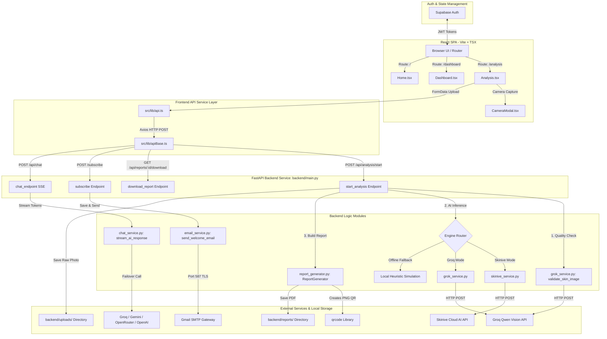

# Medicus Labs™ – Complete Project Workflow & Connection Architecture Guide

This comprehensive document details the technical architecture, component relationships, data flow sequences, and background execution models for **Medicus Labs™**. Use this reference guide to understand or present the codebase structure and connected workflows.

---

## 📑 Table of Contents
1. [Executive Summary](#1-executive-summary)
2. [Technology Stack Overview](#2-technology-stack-overview)
3. [System Architecture Diagram](#3-system-architecture-diagram)
4. [End-to-End Dermatology Scan Workflow (8 Steps)](#4-end-to-end-dermatology-scan-workflow-8-steps)
5. [Backend Architecture & Microservices](#5-backend-architecture--microservices)
   - [FastAPI Core Router (`backend/main.py`)](#fastapi-core-router-backendmainpy)
   - [Groq Qwen Vision & Quality Filter (`backend/grok_service.py`)](#groq-qwen-vision--quality-filter-backendgrok_servicepy)
   - [Skinive Cloud AI Engine (`backend/skinive_service.py`)](#skinive-cloud-ai-engine-backendskinive_servicepy)
   - [Hospital-Grade PDF Generator (`backend/report_generator.py`)](#hospital-grade-pdf-generator-backendreport_generatorpy)
   - [Streaming Medical Chatbot (`backend/chat_service.py`)](#streaming-medical-chatbot-backendchat_servicepy)
   - [Transactional Email Service (`backend/email_service.py`)](#transactional-email-service-backendemail_servicepy)
6. [Frontend Architecture & Component Tree](#6-frontend-architecture--component-tree)
7. [Database Schema & Persistence](#7-database-schema--persistence)
8. [Comprehensive File Interconnection Matrix](#8-comprehensive-file-interconnection-matrix)
9. [How to Run & Orchestrate the Platform](#9-how-to-run--orchestrate-the-platform)

---

## 1. Executive Summary

**Medicus Labs™** is an enterprise-grade, AI-driven dermatological analysis platform. It enables patients and clinicians to upload or capture high-resolution photographs of skin lesions, receive immediate AI-powered clinical condition evaluations, review quantitative skin measurements, stream answers to clinical queries from a resilient multi-model AI chatbot, and download hospital-grade 1-page PDF diagnostic reports.

---

## 2. Technology Stack Overview

### **Frontend Layer (Single Page Application)**
* **Core Framework:** React 18 with Vite (TypeScript strict mode)
* **Styling & Design System:** Tailwind CSS with modern minimalist design tokens
* **Animations:** Framer Motion (for fluid step transitions and severity meters)
* **HTTP Client:** Axios with request interceptors for token injection
* **Icons:** Lucide React
* **Authentication:** Supabase Auth (JWT & session handling)

### **Backend Layer (API Services)**
* **Framework:** Python 3.11 with FastAPI (Asynchronous Uvicorn server)
* **Image Processing:** Pillow (PIL) for resizing and byte manipulation
* **PDF Compilation:** ReportLab Engine (Custom canvas, graphics, and table flowables)
* **QR Code Generation:** Python `qrcode` package
* **Email Gateway:** `aiosmtplib` (Async SMTP over TLS)

### **Artificial Intelligence & LLM Integrations**
* **Skin Verification:** Groq Llama-3.2-11b-vision-preview
* **Dermatology Pathology AI:** Groq Llama Vision / Skinive Cloud AI API
* **Streaming Chatbot Engine:** Multi-provider failover sequence (Groq $\rightarrow$ Google Gemini 1.5 Flash $\rightarrow$ OpenRouter $\rightarrow$ OpenAI GPT-4o-mini)
* **Fallback Sandbox Engine:** Local clinical heuristic simulation for offline deployment

---

## 3. System Architecture Diagram



---

## 4. End-to-End Dermatology Scan Workflow (8 Steps)

When a user submits a skin photograph for analysis, the data travels through **8 orchestrated stages**:

```
[User Browser]                       [FastAPI Backend]                 [External AI / Modules]
      │                                      │                                    │
      ├─ 1. Form Submission & Image ────────>│                                    │
      │    (Uploads file + Patient Info)     │                                    │
      │                                      ├─ 2. Ingestion & Resizing ──────────┤ (Saves to uploads/)
      │                                      │                                    │
      │                                      ├─ 3. Human Skin Filtering ─────────>│ (Groq Vision API)
      │                                      │<── Returns is_skin & reason ───────┤
      │                                      │                                    │
      │                                      ├─ 4. Run Pathology Model ──────────>│ (Skinive or Groq)
      │                                      │<── Condition, Severity, Lesions ───┤
      │                                      │                                    │
      │                                      ├─ 5. Check Confidence (>70%) ───────┤
      │                                      │                                    │
      │                                      ├─ 6. Build PDF Report ──────────────┤ (ReportLab 1-Page)
      │                                      │                                    │
      │<─ 7. Sends Full Analysis JSON ───────┤                                    │
      │                                      │                                    │
      ├─ 8. User Requests PDF Download ─────>│                                    │
      │<─ Returns binary PDF File ───────────┤                                    │
```

### **Detailed Step Breakdown:**

#### **Step 1: Patient Input & Image Capture**
* **Files involved:** [Analysis.tsx](file:///Users/malikarjunr/labs/frontend/src/pages/Analysis.tsx) & [CameraModal.tsx](file:///Users/malikarjunr/labs/frontend/src/components/CameraModal.tsx)
* **Process:** The patient inputs clinical parameters (Full Name, Age, Gender, Mobile Number, Email Address) and selects an engine mode (`skinive` or `grok`). They upload a lesion image or take a picture using `CameraModal.tsx`.
* **API Call:** Form parameters and binary image data are packaged as `FormData` and transmitted via `analyzeImage()` in [api.ts](file:///Users/malikarjunr/labs/frontend/src/lib/api.ts) to `POST /api/analysis/start`.

#### **Step 2: Server Ingestion & Preprocessing**
* **File involved:** [main.py](file:///Users/malikarjunr/labs/backend/main.py)
* **Process:** FastAPI receives the `UploadFile` stream, validates the mimetype (`image/*`), generates a timestamped filename, and writes the bytes to `./uploads/`. The Pillow library loads the saved file and resizes it to a normalized $500\times500$ resolution while preserving aspect ratio.

#### **Step 3: Quality Control & Skin Validation Layer**
* **File involved:** [grok_service.py](file:///Users/malikarjunr/labs/backend/grok_service.py) (`validate_skin_image`)
* **Process:** Before executing heavy medical AI models, the image is passed to `llama-3.2-11b-vision-preview` on Groq. The prompt requests a strict JSON verification confirming if the photo contains human skin or a skin lesion. If the user uploaded an invalid file (e.g., an animal, vehicle, or document), the backend aborts the pipeline and returns a `400 Bad Request`.

#### **Step 4: AI Pathology Engine Execution**
* **Files involved:** [skinive_service.py](file:///Users/malikarjunr/labs/backend/skinive_service.py) & [grok_service.py](file:///Users/malikarjunr/labs/backend/grok_service.py)
* **Process:** The system routes the image to the designated engine:
  * **Skinive Engine:** Sends multipart data to Skinive.Cloud API, mapping demographic age bands and retrieving risk triages (`healthy`, `routine`, `specialist`, `urgent`).
  * **Groq Vision Engine:** Instructs Llama Vision to perform structured clinical scoring across conditions (Acne Vulgaris, Melanoma, Eczema, Psoriasis, Rosacea, Vitiligo, Dermatitis, Fungal Infection, Healthy Skin).
  * **Sandbox Fallback:** If API tokens are missing, local heuristic code inspects image dimensions and metadata keywords to return a simulation assessment for seamless offline testing.

#### **Step 5: Confidence Threshold Enforcement**
* **File involved:** [main.py](file:///Users/malikarjunr/labs/backend/main.py)
* **Process:** The backend evaluates the returned confidence score. If the score is under **70.0%**, the analysis is rejected with a message asking the user to upload a clearer, better-illuminated photograph rather than returning an uncertain medical prediction.

#### **Step 6: Clinical PDF Compilation**
* **File involved:** [report_generator.py](file:///Users/malikarjunr/labs/backend/report_generator.py)
* **Process:** The backend initializes the `ReportGenerator` service. Using `reportlab`, it compiles a 1-page clinical diagnostic PDF saved to `backend/reports/report_ANALYSIS_ID.pdf`. The report contains:
  1. Hospital brand header & unique Report ID.
  2. Patient demography grid.
  3. Specimen image embedded next to a quantitative measurements table (lesion count, average size, redness %, oiliness score).
  4. Primary classification diagnosis & color-coded severity gauge.
  5. Top 3 differential diagnoses with horizontal progress bars.
  6. Actionable care directives (immediate plan, home care, items to avoid).
  7. Clinician sign-off section & a custom verification **QR Code** generated by `qrcode`.
  8. Emergency medical disclaimer and HIPAA compliance notes.

#### **Step 7: Frontend Response Rendering**
* **Files involved:** [main.py](file:///Users/malikarjunr/labs/backend/main.py) $\rightarrow$ [Analysis.tsx](file:///Users/malikarjunr/labs/frontend/src/pages/Analysis.tsx)
* **Process:** FastAPI returns a comprehensive JSON payload containing the diagnosis, confidence percentage, symptoms dictionary, differential list, recommendations, and PDF path. Framer Motion animates the results UI on screen.

#### **Step 8: On-Demand PDF Download**
* **Files involved:** [api.ts](file:///Users/malikarjunr/labs/frontend/src/lib/api.ts) $\rightarrow$ [main.py](file:///Users/malikarjunr/labs/backend/main.py) (`/api/reports/{report_id}/download`)
* **Process:** When the user clicks "Download PDF", the frontend issues a `GET` request expecting a blob response. The backend locates the pre-generated PDF file in `reports/` (or generates it on-demand if the server restarted) and returns a `FileResponse` attachment stream.

---

## 5. Backend Architecture & Microservices

### **FastAPI Core Router (`backend/main.py`)**
The entry point of the backend system:
* Sets up CORS middleware allowing requests from local development and production frontends.
* Mounts frontend static build assets (`/assets` and SPA fallback routes).
* Implements lifespan managers for startup logging and clean shutdown.
* Exposes 15+ REST endpoints covering health checks, image validation, newsletter subscriptions, scan execution, report downloads, history retrieval, and streaming chat.

### **Groq Qwen Vision & Quality Filter (`backend/grok_service.py`)**
Handles image verification and vision model prompting:
* Encapsulates `CONDITIONS_DB` containing clinical descriptions, severity colors, recommendations, and precautions for 16 dermatological conditions.
* Implements `validate_skin_image()`: Base64 encodes thumbnail images and queries Groq to verify human skin presence.
* Implements `analyze_skin_image()`: Sends full prompts requesting structured JSON with lesion coordinate arrays (`x`, `y`, `radius`), symptom levels (redness, scaling, itching, inflammation, pigmentation), and differential probabilities.

### **Skinive Cloud AI Engine (`backend/skinive_service.py`)**
Wrapper for the Skinive Cloud Vision API:
* Maps user input age strings into normalized clinical age bands (`0-17`, `18-29`, `30-44`, `45-59`, `60+`).
* Maps Skinive class outputs (`healthy`, `acne`, `melanoma`, `eczema`, `psoriasis`, `rosacea`, `vitiligo`, `dermatitis`, `fungal`) to standardized system data models.

### **Hospital-Grade PDF Generator (`backend/report_generator.py`)**
Custom PDF renderer built using ReportLab:
* Uses `SimpleDocTemplate` configured with tight $0.35$-inch margins to guarantee single-page rendering.
* Defines custom paragraph styles (`SectionHeader`, `ClinicalBody`, `TimelineText`).
* Renders custom drawings including progress bars and a color-coded severity pointer gauge (`Circle` drawn on a multi-colored `Rect` spectrum).
* Generates verification QR codes using `qrcode` pointing to online report verification URLs.

### **Streaming Medical Chatbot (`backend/chat_service.py`)**
Real-time streaming LLM service:
* Implements an async generator `stream_ai_response()` that prepends `MEDICAL_SYSTEM_PROMPT` to enforce safe clinical communication boundaries.
* **Multi-Provider Failover:** Tries providers in priority order:
  1. Groq API (`llama-3.3-70b-versatile` $\rightarrow$ `llama-3.1-8b-instant` $\rightarrow$ `gemma2-9b-it`)
  2. Google Gemini API (`gemini-1.5-flash`)
  3. OpenRouter API (`openrouter/free`)
  4. OpenAI API (`gpt-4o-mini`)
* Streams response chunks to the frontend via Server-Sent Events (SSE).

### **Transactional Email Service (`backend/email_service.py`)**
Asynchronous email delivery gateway:
* Uses `aiosmtplib` to connect to `smtp.gmail.com:587` over STARTTLS.
* Constructs multi-part MIME messages with plain text fallbacks and responsive HTML templates.
* Sends welcome letters upon newsletter registration.

---

## 6. Frontend Architecture & Component Tree

The frontend is structured into modular components, pages, sections, and utilities:

```
frontend/src/
├── App.tsx                     # Main Router & Suspense Loader
├── index.tsx                   # React DOM Entry Point
├── components/
│   ├── PremiumNavbar.tsx       # Responsive Navigation Header
│   ├── Footer.tsx              # Footer with links & newsletter form
│   ├── CameraModal.tsx         # Real-time webcam capture modal
│   ├── ProtectedRoute.tsx      # Route guard for authenticated pages
│   └── PageLoader.tsx          # Loading spinner for lazy routes
├── contexts/
│   └── AuthContext.tsx         # Supabase Authentication State Provider
├── lib/
│   ├── api.ts                  # Axios API service layer (15+ endpoints)
│   ├── apiBase.ts              # Base URL resolver (/api or VITE_API_URL)
│   └── supabase.ts             # Supabase Client JS Initialization
├── pages/
│   ├── Home.tsx                # Landing Page with Hero & Features
│   ├── Analysis.tsx            # Main Multi-Step Skin Analysis Page
│   ├── Dashboard.tsx           # Patient Scan History & Profile Overview
│   ├── About.tsx               # About Medicus Labs
│   ├── Features.tsx            # Platform Features Detail
│   ├── Contact.tsx             # Contact Form & Location Info
│   ├── Profile.tsx             # User Settings & Account Management
│   ├── ReportIssue.tsx         # User Support & Issue Reporting
│   └── Legal Pages...          # PrivacyPolicy, TermsConditions, Disclaimer
```

---

## 7. Database Schema & Persistence

The database schema is defined in [database/schema.sql](file:///Users/malikarjunr/labs/database/schema.sql) and modeled in Python via SQLAlchemy ([backend/models.py](file:///Users/malikarjunr/labs/backend/models.py)).

### **Tables & Relationships:**

```sql
-- 1. Users Table
CREATE TABLE users (
    id VARCHAR(255) PRIMARY KEY,
    email VARCHAR(255) UNIQUE NOT NULL,
    full_name VARCHAR(255) NOT NULL,
    created_at TIMESTAMP WITH TIME ZONE DEFAULT CURRENT_TIMESTAMP
);

-- 2. Analyses Table
CREATE TABLE analyses (
    id VARCHAR(255) PRIMARY KEY,
    user_id VARCHAR(255) REFERENCES users(id),
    patient_name VARCHAR(255) NOT NULL,
    patient_age INT NOT NULL,
    patient_gender VARCHAR(50) NOT NULL,
    image_path VARCHAR(500) NOT NULL,
    condition VARCHAR(255) NOT NULL,
    confidence FLOAT NOT NULL,
    severity VARCHAR(50) NOT NULL,
    created_at TIMESTAMP WITH TIME ZONE DEFAULT CURRENT_TIMESTAMP
);

-- 3. Reports Table
CREATE TABLE reports (
    id VARCHAR(255) PRIMARY KEY,
    analysis_id VARCHAR(255) REFERENCES analyses(id),
    pdf_path VARCHAR(500) NOT NULL,
    created_at TIMESTAMP WITH TIME ZONE DEFAULT CURRENT_TIMESTAMP
);

-- 4. Email Queue Table
CREATE TABLE email_queue (
    id SERIAL PRIMARY KEY,
    recipient_email VARCHAR(255) NOT NULL,
    subject VARCHAR(255) NOT NULL,
    body TEXT NOT NULL,
    status VARCHAR(50) DEFAULT 'pending',
    scheduled_at TIMESTAMP WITH TIME ZONE,
    sent_at TIMESTAMP WITH TIME ZONE
);
```

---

## 8. Comprehensive File Interconnection Matrix

The matrix below traces how files interact across front and back ends:

| Source File | Function / Export | Target Connected File | Purpose |
| :--- | :--- | :--- | :--- |
| `frontend/src/App.tsx` | `<Routes>` | `frontend/src/pages/*` | Handles client-side SPA routing for all pages |
| `frontend/src/pages/Analysis.tsx` | `handleAnalyze()` | `frontend/src/lib/api.ts` | Calls `analyzeImage()` with uploaded image & metadata |
| `frontend/src/components/CameraModal.tsx` | `capturePhoto()` | `frontend/src/pages/Analysis.tsx` | Captures camera frame as blob and passes it to form state |
| `frontend/src/lib/api.ts` | `analyzeImage()` | `backend/main.py` | Sends HTTP POST request to `/api/analysis/start` |
| `frontend/src/lib/apiBase.ts` | `getApiBaseUrl()` | `frontend/src/lib/api.ts` | Resolves `VITE_API_URL` or defaults to `/api` |
| `backend/main.py` | `start_analysis()` | `backend/grok_service.py` | Calls `validate_skin_image()` to check human skin presence |
| `backend/main.py` | `start_analysis()` | `backend/skinive_service.py` | Calls `analyze_skin()` when engine is set to `skinive` |
| `backend/main.py` | `start_analysis()` | `backend/report_generator.py` | Calls `generate_report()` to build 1-page clinical PDF |
| `backend/main.py` | `subscribe()` | `backend/email_service.py` | Invokes `send_welcome_email()` asynchronously via SMTP |
| `backend/main.py` | `chat_endpoint()` | `backend/chat_service.py` | Calls `stream_ai_response()` to yield SSE tokens |
| `backend/report_generator.py` | `generate_report()` | `backend/reports/` | Saves compiled `report_ANALYSIS_ID.pdf` file to disk |

---

## 9. How to Run & Orchestrate the Platform

### **Option A: Run via Docker Compose (Recommended for Full Stack)**

The repository includes a [docker-compose.yml](file:///Users/malikarjunr/labs/docker-compose.yml) file orchestrating PostgreSQL, FastAPI Backend, and React Frontend containers:

```bash
# From the project root (/Users/malikarjunr/labs)
docker-compose up --build
```

* **Frontend:** Access at `http://localhost`
* **Backend API:** Access at `http://localhost:8000`
* **Swagger API Docs:** Access at `http://localhost:8000/api/docs`

---

### **Option B: Run Manually in Development Mode**

#### **1. Start FastAPI Backend Server:**
```bash
cd /Users/malikarjunr/labs/backend
python3 -m venv venv
source venv/bin/activate
pip install -r requirements.txt
python main.py
```
*(Backend runs on `http://localhost:8000`)*

#### **2. Start React Frontend Client:**
```bash
cd /Users/malikarjunr/labs/frontend
npm install
npm run dev
```
*(Frontend runs on `http://localhost:5173`)*

---

*Documentation compiled and verified for Medicus Labs™ Platform v2.0.0.*
